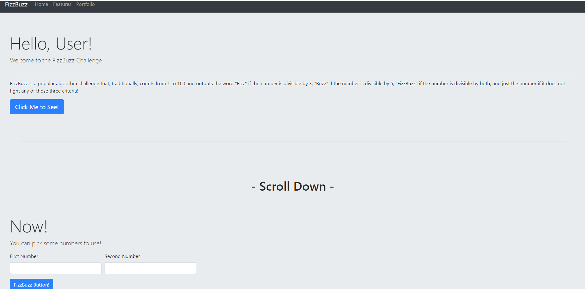
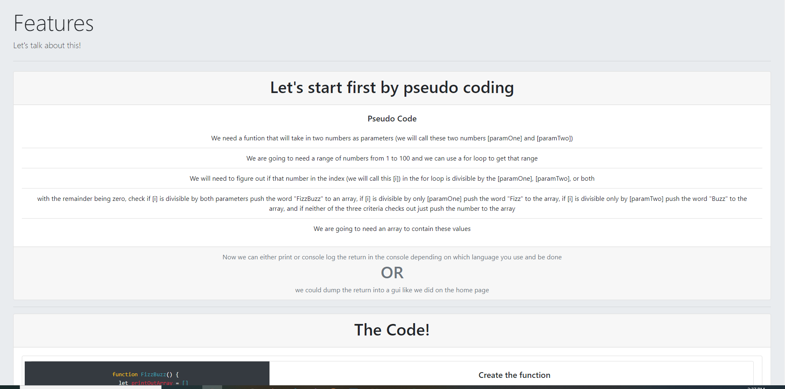

# FizzBuzz Challenge

## Overview
FizzBuzz is a popular algorithm challenge that, traditionally, counts from 1 to 100 and outputs the word "Fizz" if the number is divisible by 3, "Buzz" if the number is divisible by 5, "FizzBuzz" if the number is divisible by both, and just the number if it does not fight any of those three criteria!

### Gallery
#### Home:

### Solution
I created a user interface to visually see the output of the algorythm so that the user does not have to pull anything from a repo or do any initial set up to see the solution
## Tech and Features Used
* bootstrap 
* javascript
* html